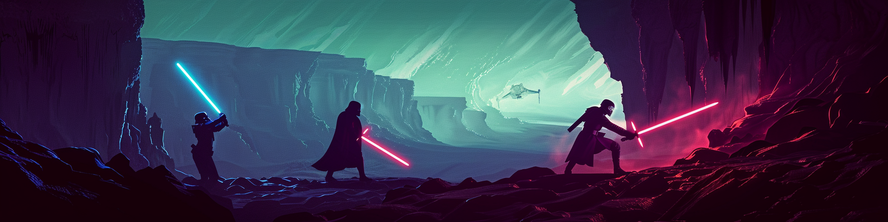
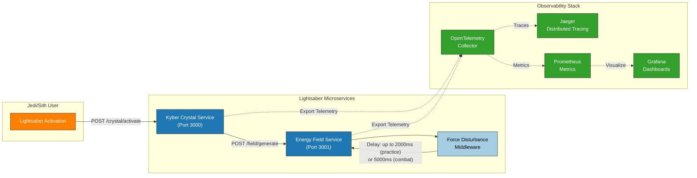

# Lightsaber Diagnostics: OpenTelemetry Demo Project



## Overview

This project demonstrates how to use OpenTelemetry to diagnose issues in distributed systems through a Star Wars-themed example. The demo was created for the conference talk **"OpenTelemetry: Because 'It Works on My Machine' Isn't a Monitoring Strategy"**.

The project simulates a lightsaber activation system with intermittent failures that only occur in combat scenarios (not during practice), showcasing how observability tools can help diagnose issues that are environment-specific - the classic "but it works on my machine" problem.

## Architecture

The system consists of two microservices working together:

1. **Kyber Crystal Service** (Port 3000): Handles lightsaber activation requests
2. **Energy Field Service** (Port 3001): Processes energy field generation with a simulated "Force Disturbance"

Both services are fully instrumented with OpenTelemetry, enabling distributed tracing and metrics collection.



## The "Unstable Lightsaber" Problem

The demo showcases a scenario where:

- Lightsabers work reliably in **practice mode** (low failure rate)
- Lightsabers fail intermittently in **combat mode** (high failure rate)

Using OpenTelemetry, we can observe that:
- The Force Disturbance middleware introduces random delays
- Delays are higher in combat mode (up to 5000ms vs 2000ms in practice)
- The system has a 2000ms timeout
- When delays exceed the timeout, the activation fails

This narrative demonstrates how OpenTelemetry provides visibility into complex, distributed systems and helps diagnose intermittent issues.

## Prerequisites

- [Node.js](https://nodejs.org/) (v16 or higher)
- [Docker](https://www.docker.com/) and [Docker Compose](https://docs.docker.com/compose/)
- [TypeScript](https://www.typescriptlang.org/) (v4.5 or higher)
- [npm](https://www.npmjs.com/) (v7 or higher)

## Getting Started

### 1. Clone the Repository

```bash
git clone https://github.com/guahanweb/lightsaber-diagnostics.git
cd lightsaber-diagnostics
```

### 2. Install Dependencies

Install dependencies for both services:

```bash
# Install dependencies for Kyber Crystal Service
cd services/kyber-crystal-service
npm install

# Install dependencies for Energy Field Service
cd ../energy-field-service
npm install

# Install dependencies for Traffic Simulator
cd ../../jedi-archives/simulator
npm install

# Return to project root
cd ../..
```

### 3. Start the System

Use the startup script to start all the services:

```bash
./startup.sh

# or Docker Compose directly
cd jedi-archives
docker compose up -d
```

This will start:
- Kyber Crystal Service (Node.js/TypeScript)
- Energy Field Service (Node.js/TypeScript)
- Jaeger (Distributed Tracing)
- Prometheus (Metrics Collection)
- Grafana (Metrics Visualization)
- OpenTelemetry Collector

### 4. Verify the Setup

Check that all services are running:

```bash
docker compose ps
```

Access the different UIs:
- Kyber Crystal Service API: http://localhost:3000
- Energy Field Service API: http://localhost:3001
- Jaeger UI: http://localhost:16686
- Prometheus: http://localhost:9090
- Grafana: http://localhost:3002 (username: admin, password: admin)

## Generating Traffic

The repository includes several scripts to generate different types of traffic:

### Training Mode (Low Failure Rate)

```bash
./training-mode.sh
```

This generates primarily practice mode activations (20% combat) with longer intervals between requests.

### Battle Mode (High Failure Rate)

```bash
./battle-mode.sh
```

This generates primarily combat mode activations (80% combat) with shorter intervals, demonstrating the failure scenario.

### Stress Test

```bash
./stress-test.sh
```

This generates balanced but rapid activations to show system behavior under load.

## Manual API Testing

You can also manually test the APIs:

### Activate a Lightsaber

```bash
curl -X POST http://localhost:3000/crystal/activate \
  -H "Content-Type: application/json" \
  -d '{"crystalType": "blue", "owner": "Luke Skywalker", "powerLevel": 8, "mode": "combat"}'
```

## Understanding the Code

### Project Structure

```
/lightsaber-diagnostics
  /services
    /kyber-crystal-service       # Handles lightsaber activation requests
      /src
        index.ts                 # Service entry point
        tracer.ts                # OpenTelemetry configuration
        crystal.controller.ts    # API endpoints
        crystal.service.ts       # Business logic
    /energy-field-service        # Processes energy field generation
      /src
        index.ts                 # Service entry point
        tracer.ts                # OpenTelemetry configuration
        field.controller.ts      # API endpoints
        field.service.ts         # Business logic
        force-disturbance.middleware.ts  # Simulates random delays
  /jedi-archives                 # Observability stack configuration
    /collector-config            # OpenTelemetry Collector configuration
    /grafana-dashboards          # Pre-configured Grafana dashboards
    /prometheus-config           # Prometheus configuration
    /simulator                   # Processes automated traffic simulation
      /src
        generator.ts             # Core TypeScript traffic generator
    docker-compose.yml           # Docker Compose configuration
  training-mode.sh               # Generates mostly practice mode traffic
  battle-mode.sh                 # Generates mostly combat mode traffic
  stress-test.sh                 # Generates high-volume traffic
  startup.sh                     # Starts up the whole stack
  README.md                      # This file
```

### Key Components

#### 1. OpenTelemetry Configuration (tracer.ts)

Both services use auto-instrumentation for HTTP and Express, plus custom instrumentation for business logic.

#### 2. Force Disturbance Middleware (force-disturbance.middleware.ts)

This middleware simulates random delays, with higher delays in combat mode. This is the source of the intermittent failures.

#### 3. Traffic Generation (lightsaber-traffic-generator.ts)

Generates random lightsaber activation requests with configurable parameters.

## Observing the System

### 1. Distributed Tracing with Jaeger

Jaeger visualizes the complete request flow:

1. Open Jaeger UI: http://localhost:16686
2. Select "kyber-crystal-service" from the Service dropdown
3. Click "Find Traces"
4. Compare successful and failed traces to see the difference in duration
5. Look at span details to see custom attributes like `crystal.type`, `crystal.owner`, etc.

### 2. Metrics with Prometheus and Grafana

Access pre-configured dashboards showing:

1. Open Grafana: http://localhost:3000
2. Navigate to Dashboards
3. Select "Lightsaber Performance Dashboard"

Key metrics include:
- Activation rates by mode (combat vs. practice)
- Activation duration by mode
- Success rates by crystal type
- System performance metrics

## The Bug and Its Solution

### The Bug

The system has a 2000ms timeout for requests to the Energy Field Service, but the Force Disturbance middleware can introduce delays of up to 5000ms in combat mode.

### Solutions

1. **Increase the timeout**:
   - Modify the timeout in the Kyber Crystal Service to exceed the maximum delay

2. **Reduce the maximum delay**:
   - Modify the Force Disturbance middleware to have a maximum delay below the timeout

3. **Add retry logic**:
   - Implement retry logic in the Kyber Crystal Service for failed requests

## Extending the Project

Here are some ideas for extending the project:

1. **Add more metrics**: Implement custom metrics for business-specific monitoring
2. **Add log correlation**: Integrate OpenTelemetry logs with traces
3. **Add a frontend**: Create a React/Angular/Vue frontend for the lightsaber hilt
4. **Add more complex scenarios**: Implement additional failure modes or complex business logic
5. **Deploy to Kubernetes**: Create Kubernetes manifests for deploying to a cluster

## Conference Talk

This project was created for the talk [**"OpenTelemetry: Because 'It Works on My Machine' Isn't a Monitoring Strategy"**](https://javascript-conference.com/architecture-performance/instrumenting-javascript-opentelemetry/) presented at the *International JavaScript Conference in San Diego*. 

## Troubleshooting

### Common Issues

1. **Services won't start**:
   - Check if ports 3000 and 3001 are already in use
   - Verify Docker is running

2. **No traces in Jaeger**:
   - Check that the OpenTelemetry Collector is running
   - Verify service configuration in tracer.ts files

3. **Can't see Grafana dashboards**:
   - Ensure Prometheus is running and collecting metrics
   - Import the dashboards manually from /jedi-archives/grafana-dashboards

## Contributing

Contributions are welcome! Please feel free to submit a Pull Request.

## License

This project is licensed under the MIT License - see the LICENSE file for details.

## Acknowledgments

- OpenTelemetry community for the amazing tools
- Star Wars for the inspiration
- All the Jedi and Sith who contributed to the project

May the Force (and observability) be with you!
